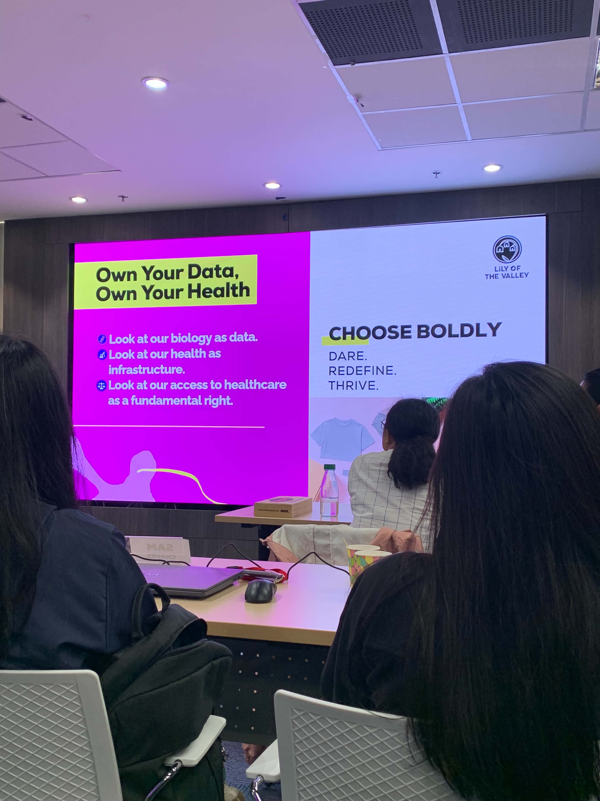
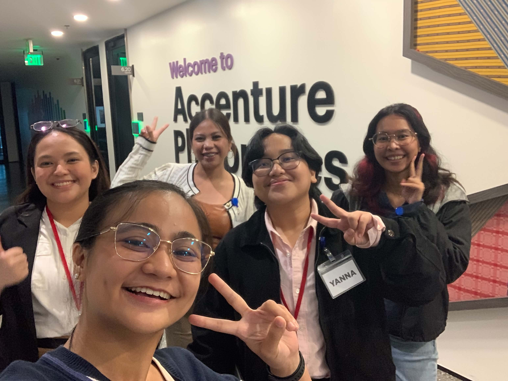
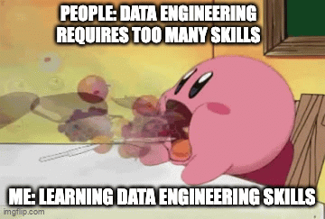

# Journal - 2026-08-29 - Day 6 of 14

Use this version only if you want more structure. The basic `entry.md` is enough for most days.

## Today in one sentence
- Today, I learned all about pipeline and engineering

## What I learned
- Building a successful pipeline goes beyond database structure as it requires connecting the raw data all the way to actionable insights on dashboards while effectively communicating technical choices, assumptions, and team processes.
- Designing data models is important as it requires choosing the right level of grain and balancing factors for dimension creation like query simplicity, performance, and analytical depth.

## Terms I am still learning
- **Denormalization** - utilized when we want to simplify our query complexity by intentionally introducing data redundancy
- 

## What confused me
- Version Control in the databricks interface for a project, this is quite a new topic that was not yet introduced.

## One small next step
- [ ] Practice designing data models
- [ ] Create projects that provides an end-to-end pipeline

## Git checkpoint
- [ ] I created or updated a file
- [ ] I wrote a commit
- [ ] I pushed my changes

## Proof of life

## Reflection 
- What felt easy today? Since we had experiences before in utilizing github in projects and version controls
- What felt difficult today? Understanding where to shift the perspectives from OLTP to OLAP (vice versa) 
- What do I want to understand better next time? Learn more how we can improve the utilization of GitHub to our projects and provide better engineered pipelines thru validations

## Mood of the day

